# cv-datasheets

Datasheets are documents that describe each language dataset in [Common Voice](https://commonvoice.mozilla.org/). This repository maintains **templates, community-written content, and metadata** that are compiled into a single JSON file consumed by the bundler pipeline at release time.

## Data Pipeline

```mermaid
flowchart LR
    SCS_DB[("SCS DB")]
    SPS_DB[("SPS DB")]
    GCS_C[("GCS
    SCS clips")]
    DS["cv-datasheets ◀"]
    GCS_A[("GCS
    SPS audio")]
    GCS_DS[("GCS
    datasets
    datasheets
    stats")]
    MDC[["MDC (downloads)"]]
    CDS[["cv-dataset"]]

    subgraph SCS_B["SCS Bundler"]
        CC["CorporaCreator"]
    end

    subgraph SPS_B["SPS Bundler"]
        QA["QA Pipeline"]
    end

    SCS_DB --> SCS_B
    GCS_C --> SCS_B
    DS -->|templates
    + custom| SCS_B
    DS -->|templates
    + custom| SPS_B
    SPS_DB --> SPS_B
    GCS_A --> SPS_B
    SCS_B --> GCS_DS
    SPS_B --> GCS_DS
    GCS_DS -->|datasets| MDC
    GCS_DS -->|datasheets| MDC
    GCS_DS -->|stats| CDS

    style DS fill:#1a73e8,color:#ffffff,stroke:#1558b0,stroke-width:2px
    style GCS_C fill:#333,stroke:#383c8e
    style GCS_A fill:#333,stroke:#383c8e
    style GCS_DS fill:#333,stroke:#383c8e
    style CC fill:#333,stroke:#fefefe,stroke-width:1px
    style QA fill:#333,stroke:#fefefe,stroke-width:1px
```



## How it works

```txt
API snapshot ──────┐
templates/        ─┤
content/locales/  ─┤── compile_datasheets.py ──> releases/datasheets-{snapshot_date}.json
metadata/         ─┘                                       │
                                                    Bundler fills {{KEY}} with live stats
                                                           │
                                                    README.md per locale in dataset tar
```

For details on the compile-time vs runtime split, Jinja2 role, and bundler integration, see [docs/ARCHITECTURE.md](docs/ARCHITECTURE.md).

## Community contribution

Language communities are the experts on their languages. We ask community members to contribute datasheet content for their language(s) via Pull Requests.

1. Look at `content/_template/` for the directory structure, file list, and field types
2. Look at `content/_example/` for a filled-in reference (fictional Klingon locale)
3. Create or edit files under `content/locales/{your-locale-code}/`
4. Submit a Pull Request

Datasheets can also be submitted via Google Forms or email. For the full contributor guide, directory structure, additive vs descriptive field rules, and form links, see [docs/CONTRIBUTING.md](docs/CONTRIBUTING.md).

Want to have the datasheet in your own language? See [How to Add a Translated Datasheet](docs/CONTRIBUTING.md#how-to-add-a-translated-datasheet).

## Repository structure

```txt
cv-datasheets/
├── templates/                  Jinja2 templates
│   ├── base.md.j2                Shared skeleton
│   ├── scripted.md.j2            SCS child template
│   ├── spontaneous.md.j2         SPS child template
│   ├── i18n/                     Section title translations (auto-discovered)
│   └── _legacy/                  Old plain markdown templates (reference)
│
├── content/                    Community content
│   ├── _field_map.json           Field-to-bundler-key mapping
│   ├── _defaults/                Fallback content per template language
│   ├── _template/                Empty file structure for contributors
│   ├── _example/                 Filled-in example (Klingon)
│   └── locales/{code}/           Per-locale content (shared/, scripted/, spontaneous/)
│
├── metadata/                   Static data files
│   ├── api-snapshots/            Timestamped API snapshots (language names, variants, accents)
│   ├── locale-extras.json        Locales not in API (el-CY, ms-MY)
│   ├── template-languages.json   Non-"en" template overrides
│   └── funding.tsv               OMSF-funded locales
│
├── scripts/                    Utilities
│   ├── fetch_api_metadata.py     Fetch SCS + SPS API -> snapshot
│   └── extract_community_data.py One-time extraction from legacy datasheets
│
├── compile_datasheets.py       Main compile script
├── schema/                     JSON Schema for output validation
├── docs/                       Documentation
│   ├── ARCHITECTURE.md           System design and bundler integration
│   ├── CONTRIBUTING.md           Community contribution guide
│   └── COMPILING.md              Compile script usage and release workflow
│
├── releases/                   Compiled output (datasheets-{snapshot_date}.json)
│
└── _legacy/                    Deprecated scripts, metadata, and generated datasheets
```

## Quick start

Fetch a fresh API snapshot and compile:

```bash
python3 scripts/fetch_api_metadata.py
python3 compile_datasheets.py 2026-03-09 \
    --api-snapshot metadata/api-snapshots/languagedata-20260226.json \
    --pretty
```

Compare against a previous release:

```bash
python3 compile_datasheets.py 2026-03-09 \
    --api-snapshot metadata/api-snapshots/languagedata-20260226.json \
    --diff releases/datasheets-2025-09-05.json --pretty
```

For all options and the release workflow, see [docs/COMPILING.md](docs/COMPILING.md).
