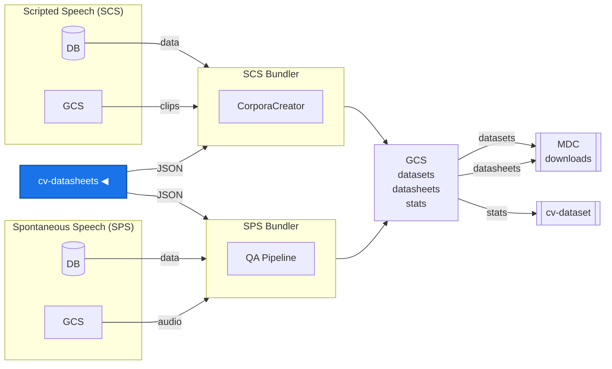

# cv-datasheets

Datasheets are documents that describe each language dataset in [Common Voice](https://commonvoice.mozilla.org/). This repository maintains **templates, community-written content, and metadata** that are compiled into a single JSON file consumed by the bundler pipeline at release time.

## Data Pipeline



## How it works

```txt
API snapshot ──────┐
templates/        ─┤
content/locales/  ─┤── compile_datasheets.py ──> releases/datasheets-{snapshot_date}.json
metadata/         ─┘                                       │
                                                    Bundler fills {{KEY}} with live stats
                                                           │
                                                    README.md per locale in dataset tar
```

For details on the compile-time vs runtime split, Jinja2 role, and bundler integration, see [docs/ARCHITECTURE.md](docs/ARCHITECTURE.md).

## Community contribution

Language communities are the experts on their languages. We ask community members to contribute datasheet content for their language(s) via Pull Requests.

> **Please submit one PR per locale** so that previews and reviews stay focused.

For the full contributor guide, directory structure, field rules, and form links, see [docs/CONTRIBUTING.md](docs/CONTRIBUTING.md). Want to have the datasheet in your own language? See [How to Add a Translated Datasheet](docs/CONTRIBUTING.md#how-to-add-a-translated-datasheet).

## Preview

Preview how your content will look in the final datasheet: `python3 scripts/preview_datasheets.py -l {locale}`. On Pull Requests, a preview is posted automatically as a comment.

See [docs/COMPILING.md - Previewing](docs/COMPILING.md#previewing) for details.

## CI/CD

- **Preview** (`preview.yml`) - Auto-generates a preview comment on every PR that touches content, templates, or metadata.
- **Auto-compile** (`compile-latest.yml`) - On merge to `main`, compiles and commits `releases/datasheets-latest.json`.

See [docs/COMPILING.md - Auto-Compile](docs/COMPILING.md#auto-compile) and [docs/ARCHITECTURE.md - CI/CD](docs/ARCHITECTURE.md#cicd) for details.

## Quick start

Fetch a fresh API snapshot and compile:

```bash
python3 scripts/fetch_api_metadata.py
python3 compile_datasheets.py 2026-03-09 \
    --api-snapshot metadata/api-snapshots/languagedata-20260226.json \
    --pretty
```

Compare against a previous release:

```bash
python3 compile_datasheets.py 2026-03-09 \
    --api-snapshot metadata/api-snapshots/languagedata-20260226.json \
    --diff releases/datasheets-2025-09-05.json --pretty
```

For all options and the release workflow, see [docs/COMPILING.md](docs/COMPILING.md).

## Related repositories

| Repository                                                       | Description                                |
| ---------------------------------------------------------------- | ------------------------------------------ |
| [common-voice](https://github.com/common-voice/common-voice)     | Scripted Speech (SCS) - main app + bundler |
| spontaneous-speech (private)                                     | Spontaneous Speech (SPS) - app + bundler   |
| [cv-dataset](https://github.com/common-voice/cv-dataset)         | Dataset stats collection and releases      |
| [CorporaCreator](https://github.com/common-voice/CorporaCreator) | Train/dev/test splitting algorithm         |

## Acknowledgements

The PR preview workflow uses [peter-evans/create-or-update-comment](https://github.com/peter-evans/create-or-update-comment) and [peter-evans/find-comment](https://github.com/peter-evans/find-comment) for GitHub Actions PR comments.
